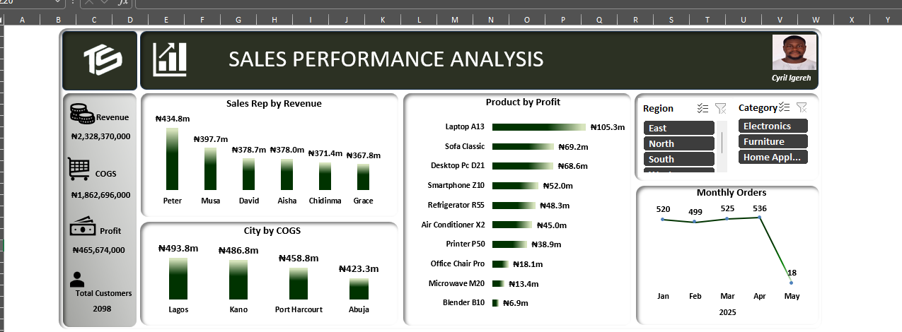

# 📊 Sales Performance Analysis

## 📌 Objective
To analyze sales data across regions, cities, and sales representatives in order to identify performance trends and revenue drivers.

## 🛠 Tools Used
- Microsoft Excel (Data Cleaning & Dashboard)

## 🧹 Data Cleaning
- Cleaned and structured raw sales data for analysis
- Ensured consistency in data fields such as regions, cities, and pricing
- Removed inconsistencies and prepared dataset for reporting

## 🔍 Analysis
- Analyzed sales performance across different regions and cities
- Evaluated contribution of sales representatives to overall revenue
- Assessed pricing and quantity trends impacting revenue

## 📊 Dashboard

## 🔍 Key Insights
- Certain regions consistently outperformed others in total revenue
- A small number of sales reps contributed significantly to sales performance
- Pricing and quantity variations had a direct impact on revenue distribution

## 💡 Recommendations
- Focus on high-performing regions for expansion opportunities  
- Provide targeted support and incentives to top-performing sales representatives  
- Optimize pricing strategies based on demand patterns and regional performance  
