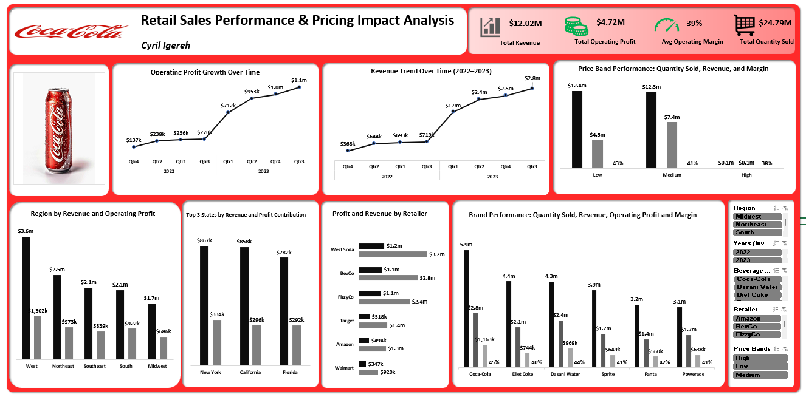

# 🥤 Coca-Cola Sales Analysis

## 📌 Objective
To analyze sales data and identify key trends, patterns, and revenue drivers.

## 🛠 Tools Used
- Microsoft Excel
- Power BI

## 🔍 Key Insights
- Certain regions outperformed others significantly
- Mid-priced products generated the highest revenue
- Sales trends varied across locations

## 💡 Business Recommendations
- Focus on high-performing regions for expansion
- Increase promotion of mid-priced products
- Optimize underperforming locations

## 📊 Dashboard

