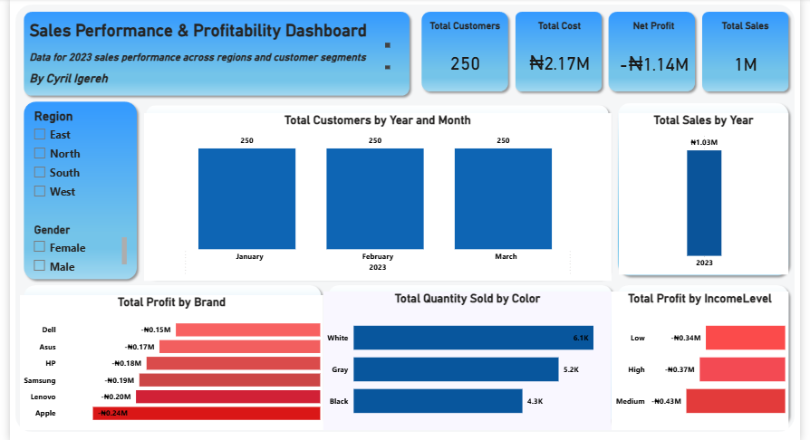

# 📊 Sales Performance & Profitability Dashboard

## 📌 Objective
To analyze sales performance, customer behavior, and profitability across different regions and product segments.

## 🛠 Tools Used
- Power BI

## 📊 Dashboard

## 🔍 Analysis
- Evaluated total sales, cost, and profitability metrics
- Analyzed customer distribution across months
- Compared brand-level performance and profitability
- Assessed product demand based on color segmentation
- Examined profitability across different income levels

## 🔍 Key Insights
- The business recorded an overall net loss, indicating cost inefficiencies  
- Certain brands contributed more significantly to losses  
- Customer numbers remained stable across months  
- Product preferences varied significantly by category  

## 💡 Recommendations
- Investigate high-cost areas contributing to overall losses  
- Focus on profitable product segments and reduce underperforming ones  
- Optimize pricing and cost strategies to improve net profitability  
